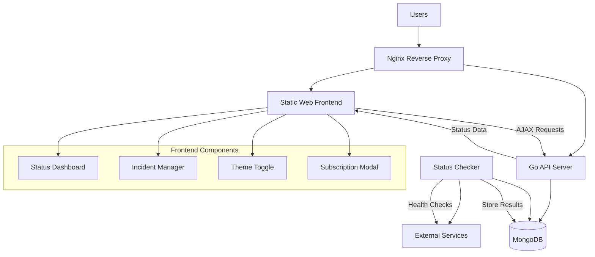
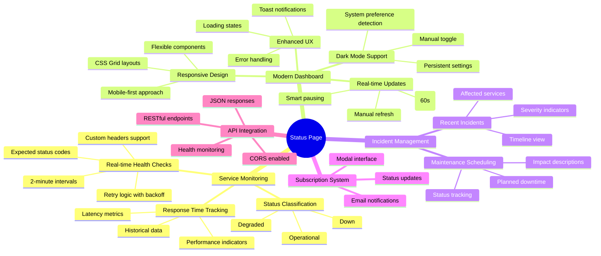
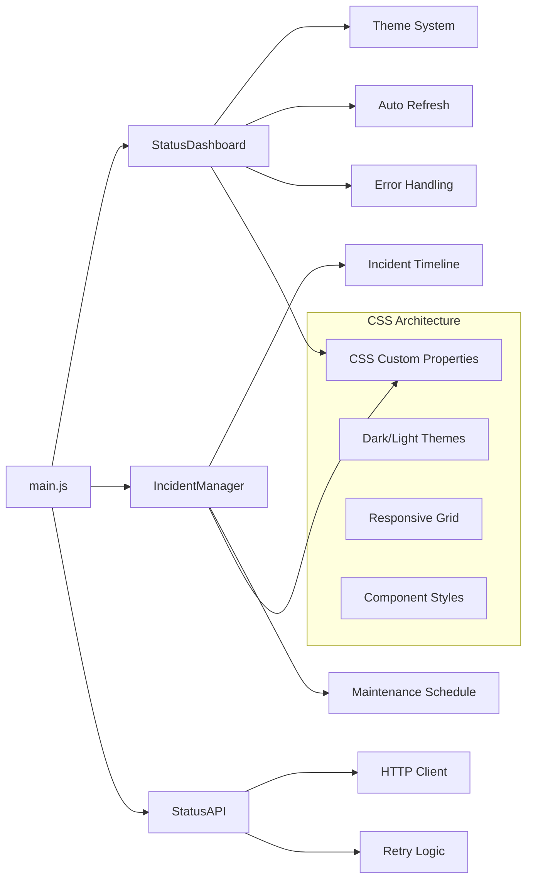
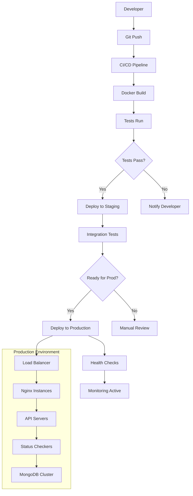

# Status Page Starter

A complete status page solution with real-time service monitoring, built with Go, MongoDB, and modern web technologies. Features a modern, responsive dashboard with dark mode, real-time updates, incident tracking, and maintenance scheduling.

## 🏗️ Architecture



### Core Components
- **MongoDB**: Document database for services, status logs, incidents, and maintenance
- **Go Status Checker**: Automated health checks every 2 minutes with retry logic
- **Go API Server**: RESTful API with CORS support serving real-time status data
- **Modern Web Frontend**: Responsive SPA with dark mode and real-time updates
- **Nginx**: High-performance reverse proxy and static file serving

## 🚀 Quick Start

### Prerequisites
- Docker and Docker Compose
- Git

### Setup
1. Clone the repository:
```bash
git clone https://github.com/sukhera/uptime-monitor.git
cd uptime-monitor
```

2. Start all services:
```bash
docker-compose up -d
```

3. Access the status page:
- **Status Dashboard**: http://localhost
- **API Endpoint**: http://localhost/api/status
- **API Health**: http://localhost/api/health

## 📊 Features



### 🔧 Tech Stack

#### Backend
- **Go 1.21+**: High-performance backend services
- **MongoDB**: Document-based data storage
- **Docker**: Containerized deployment
- **Nginx**: Reverse proxy and static serving

#### Frontend
- **Vanilla JavaScript (ES6+)**: Modern JavaScript features
- **CSS Custom Properties**: Theme system and variables
- **CSS Grid & Flexbox**: Responsive layouts
- **Web APIs**: LocalStorage, Fetch API, Service Workers

#### Infrastructure  
- **Docker Compose**: Multi-service orchestration
- **Kubernetes**: Production deployment (optional)
- **GitHub Actions**: CI/CD pipeline ready

## 🔧 Configuration

### Adding Services
Services are stored in MongoDB. You can add them via the seed script or directly:

```javascript
// Example service configuration
{
  name: "My API",
  slug: "my-api",
  url: "https://api.example.com/health",
  headers: {
    "Authorization": "Bearer token"
  },
  expected_status: 200,
  enabled: true
}
```

### Environment Variables
- `MONGO_URI`: MongoDB connection string (default: `mongodb://localhost:27017`)
- `PORT`: API server port (default: `8080`)

## 📁 Project Structure

```
status_page_starter/
├── cmd/                        # Application entry points
│   ├── api/                   # API server main
│   └── status-checker/        # Status checker main
├── internal/                  # Private application code
│   ├── api/                  # API handlers, middleware, routes
│   ├── checker/              # Health checking logic
│   ├── database/             # Database connections
│   ├── models/               # Data models
│   └── config/               # Configuration management
├── configs/                  # Configuration files
│   ├── docker/              # Docker configurations
│   │   ├── Dockerfile.api
│   │   ├── Dockerfile.status-checker
│   │   └── docker-compose.*.yml
│   ├── nginx/               # Nginx configurations
│   └── env/                 # Environment templates
├── web/                     # Modern Frontend Application
│   ├── src/                 # Source files
│   │   ├── components/      # JavaScript components
│   │   │   ├── StatusDashboard.js    # Main dashboard
│   │   │   └── IncidentManager.js    # Incident tracking
│   │   ├── services/        # API service layer
│   │   │   └── api.js       # HTTP client
│   │   ├── styles/          # CSS stylesheets
│   │   │   └── main.css     # Modern CSS with variables
│   │   └── main.js          # Application entry point
│   └── dist/                # Production build
│       ├── index.html       # Semantic HTML5
│       ├── js/              # Compiled JavaScript
│       └── styles/          # Compiled CSS
├── data/                    # Data and seed files
├── scripts/                 # Deployment and utility scripts
├── docs/                    # API and architecture documentation
├── tests/                   # Test files
├── deployments/             # Deployment configurations (K8s, Helm)
├── docker-compose.yml       # Main service orchestration
├── go.mod                   # Go module definition
└── README.md               # This comprehensive guide
```

### Frontend Architecture



## 🛠️ Development

### Local Development
1. Start MongoDB:
```bash
docker-compose up mongo -d
```

2. Run status checker:
```bash
go run ./cmd/status-checker
```

3. Run API server:
```bash
go run ./cmd/api
```

4. Serve web frontend:
```bash
cd web/dist
python -m http.server 8000
```

### Using Scripts

Build the project:
```bash
./scripts/build.sh
```

Deploy to different environments:
```bash
./scripts/deploy.sh dev    # Development
./scripts/deploy.sh prod   # Production
```

Seed the database:
```bash
./scripts/seed-db.sh
```

### Database Schema

#### Services Collection
```javascript
{
  name: "Service Name",
  slug: "service-slug",
  url: "https://service.com/health",
  headers: {}, // Optional custom headers
  expected_status: 200,
  enabled: true
}
```

#### Status Logs Collection
```javascript
{
  service_name: "Service Name",
  status: "operational|degraded|down",
  latency_ms: 150,
  status_code: 200,
  error: "Error message if any",
  timestamp: ISODate("2024-01-01T00:00:00Z")
}
```

## 🔍 Monitoring

### Logs
View service logs:
```bash
# Status checker logs
docker-compose logs status-checker

# API logs
docker-compose logs api

# All logs
docker-compose logs -f
```

### Database
Connect to MongoDB:
```bash
docker-compose exec mongo mongosh
```

## 🚀 Deployment

### Deployment Flow



### Production Considerations

#### Security
- **SSL/TLS**: Configure HTTPS in nginx with proper certificates
- **Environment Variables**: Secure secret management
- **Network Security**: Firewall rules and VPC configuration
- **Access Control**: API rate limiting and authentication

#### Performance  
- **Caching**: Redis for frequent queries
- **CDN**: Static asset delivery
- **Database**: MongoDB replica set with proper indexing
- **Monitoring**: Prometheus, Grafana, and alerting

#### Scalability
- **Horizontal Scaling**: Multiple API and checker instances
- **Load Balancing**: Nginx upstream configuration
- **Database Sharding**: For high-volume deployments
- **Container Orchestration**: Kubernetes for production

### Docker Deployment
```bash
# Build and start all services
docker-compose up -d --build

# Scale specific services
docker-compose up -d --scale api=3 --scale status-checker=2

# Update services with zero downtime
docker-compose pull
docker-compose up -d --no-deps api status-checker

# Production deployment
docker-compose -f docker-compose.prod.yml up -d
```

### Kubernetes Deployment
```bash
# Apply Kubernetes manifests
kubectl apply -f deployments/kubernetes/

# Check deployment status
kubectl get pods -n status-page

# Scale deployment
kubectl scale deployment api --replicas=5
```

## ✨ Modern Features

### Enhanced User Experience
- **🌙 Dark Mode**: System preference detection with manual toggle
- **📱 Mobile-First**: Responsive design that works on all devices  
- **⚡ Real-time Updates**: Smart auto-refresh with visibility API integration
- **🔄 Error Recovery**: Exponential backoff retry logic with user feedback
- **💾 Offline Ready**: Service Worker registration for PWA capabilities

### Advanced UI Components  
- **🎨 Modern Design System**: CSS custom properties with consistent theming
- **🔔 Toast Notifications**: Non-intrusive user feedback system
- **📊 Status Indicators**: Color-coded health visualization with animations
- **⏱️ Smart Time Display**: Relative timestamps (e.g., "2 minutes ago")
- **🎭 Loading States**: Skeleton screens and spinners for better perceived performance

### Incident & Maintenance Management
- **📈 Incident Timeline**: Severity-based incident tracking with affected services
- **🔧 Maintenance Scheduler**: Planned downtime with impact descriptions
- **📧 Email Subscriptions**: Modal-based notification signup system
- **📋 Historical View**: Past incidents and maintenance records

### Developer Experience
- **🏗️ Component Architecture**: Modular JavaScript with clear separation of concerns
- **🎯 Accessibility**: ARIA labels, semantic HTML, and keyboard navigation
- **🧪 Progressive Enhancement**: Works without JavaScript, enhanced with it
- **📐 CSS Grid Layouts**: Modern layout system with fallbacks

### Performance Optimizations
- **⚡ Efficient DOM Updates**: Minimal re-renders with smart diffing
- **🗜️ Optimized Assets**: Compressed CSS and JavaScript
- **🔄 Smart Caching**: Browser storage for theme preferences
- **📊 Reduced Motion**: Respects user accessibility preferences

## 🤝 Contributing

### Development Workflow
1. **Fork** the repository
2. **Clone** your fork locally
3. **Create** a feature branch (`git checkout -b feature/amazing-feature`)
4. **Make** your changes following the coding standards
5. **Test** your changes thoroughly
6. **Commit** with conventional commit messages
7. **Push** to your fork (`git push origin feature/amazing-feature`)
8. **Submit** a pull request with detailed description

### Code Standards
- **Go**: Follow `gofmt` and `golint` standards
- **JavaScript**: ES6+ with modern patterns, avoid jQuery
- **CSS**: Use custom properties, mobile-first approach
- **HTML**: Semantic HTML5 with proper accessibility

### Testing
```bash
# Run Go tests
go test ./...

# Frontend testing (if implemented)
npm test

# Integration tests
docker-compose -f docker-compose.test.yml up --abort-on-container-exit
```

## 📄 License

MIT License - see LICENSE file for details.
